# Design of Responsive Website
## AIM:
To design a responsive website with two break points.

## DESIGN STEPS:
### Step 1: 
Requirement collection.
### Step 2:
Creating the layout using HTML and CSS.
### Step 3:
Updating the sample content.
### Step 4:
Choose the appropriate style and color scheme.
### Step 5:
Validate the layout in various browsers.
### Step 6:
Validate the HTML code.
### Step 7:
### Step 9:
Publish the website in the given URL.

## PROGRAM:

### home.html
```
<!doctype html>
<html lang="en">

<head>
    <!-- Required meta tags -->
    <meta charset="utf-8">
    <meta name="viewport" content="width=device-width, initial-scale=1, shrink-to-fit=no">

    <!-- Bootstrap CSS -->
    <link rel="stylesheet" href="https://maxcdn.bootstrapcdn.com/bootstrap/4.0.0/css/bootstrap.min.css"
        integrity="sha384-Gn5384xqQ1aoWXA+058RXPxPg6fy4IWvTNh0E263XmFcJlSAwiGgFAW/dAiS6JXm" crossorigin="anonymous">

    <title>Responsive Product Design</title>
</head>

<body>
    <div class="jumbotron" style="background-color:rgb(251, 174, 84);">
        <div class="container text-center">
            <h1 class="display-3">Copper Private Limited</h1>
            <h5 class="display-6">We Manufacture high quality Copper products</h5>
        </div>
    </div>
    <div class="container">
        <div class="row text-center" style="background-color:rgb(248, 216, 140);">
            <div class="col-12 col-md-3 "><a href="/home">home</a></div>
            <div class="col-12 col-md-3 "><a href="/products">products</a></div>
            <div class="col-12 col-md-3 "><a href="/people">people</a></div>
            <div class="col-12 col-md-3 "><a href="/contactus">contactus</a></div>
        </div>
        <div class="row text-center">
            <div class="col-12">
                <h3 class="display-6">About us</h3>
            </div>
        </div>
            
    <div class="contenttext">
        Established in the year 2004, we “Copper Private Limited” have gained immense recognition in the domestic market as a
        leading trader of Ferrous & Non – Ferrous metal Products. Procured from authenticated vendors, these products
        are assured to be at par with the international quality standards.
        <h2>Our range encompasses following products:</h2>
        <ul>
            <li>Forging</li>
            <li>Structural Steels</li>
            <li>Plates </li>
            <li>Pipes & Tubes</li>
            <li>Manifold Blocks</li>
            <li>Alloy Steels</li>
            <li>Bright Bars</li>
            <li>Fittings</li>
            <li>Castings</li>
            <li>Industrial Steels</li>
        </ul>
    </div>
        <div class="row text-center" style="background-color:rgb(251, 174, 84);">
            <div class="col-12">
                <p>Copyright © 2021 Silicon Private Limited, Developed by Gowri</p>
            </div>
        </div>
    </div>


    <!-- Optional JavaScript -->
    <!-- jQuery first, then Popper.js, then Bootstrap JS -->
    <script src="https://code.jquery.com/jquery-3.2.1.slim.min.js"
        integrity="sha384-KJ3o2DKtIkvYIK3UENzmM7KCkRr/rE9/Qpg6aAZGJwFDMVNA/GpGFF93hXpG5KkN"
        crossorigin="anonymous"></script>
    <script src="https://cdnjs.cloudflare.com/ajax/libs/popper.js/1.12.9/umd/popper.min.js"
        integrity="sha384-ApNbgh9B+Y1QKtv3Rn7W3mgPxhU9K/ScQsAP7hUibX39j7fakFPskvXusvfa0b4Q"
        crossorigin="anonymous"></script>
    <script src="https://maxcdn.bootstrapcdn.com/bootstrap/4.0.0/js/bootstrap.min.js"
        integrity="sha384-JZR6Spejh4U02d8jOt6vLEHfe/JQGiRRSQQxSfFWpi1MquVdAyjUar5+76PVCmYl"
        crossorigin="anonymous"></script>

</body>

</html>
```

### products.html
```
<!doctype html>
<html lang="en">

<head>
    <!-- Required meta tags -->
    <meta charset="utf-8">
    <meta name="viewport" content="width=device-width, initial-scale=1, shrink-to-fit=no">

    <!-- Bootstrap CSS -->
    <link rel="stylesheet" href="https://maxcdn.bootstrapcdn.com/bootstrap/4.0.0/css/bootstrap.min.css"
        integrity="sha384-Gn5384xqQ1aoWXA+058RXPxPg6fy4IWvTNh0E263XmFcJlSAwiGgFAW/dAiS6JXm" crossorigin="anonymous">

    <title>Responsive Product Design</title>
</head>

<body>
    <div class="jumbotron" style="background-color:rgb(251, 174, 84);">
        <div class="container text-center">
            <h1 class="display-3">Copper Private Limited</h1>
            <h5 class="display-6">We Manufacture high quality Copper products</h5>
        </div>
    </div>
    <div class="container">
        <div class="row text-center" style="background-color:rgb(248, 216, 140);">
            <div class="col-12 col-md-3 "><a href="/home">home</a></div>
            <div class="col-12 col-md-3 "><a href="/products">products</a></div>
            <div class="col-12 col-md-3 "><a href="/people">people</a></div>
            <div class="col-12 col-md-3 "><a href="/contactus">contactus</a></div>
        </div>
        <div class="row text-center">
            <div class="col-12">
                <h3 class="display-6">Our Premium Products</h3>
            </div>
        </div>
            <div class="row text-center">
            <div class="card col-12 col-md-6 col-lg-3">
                
                <div class="card-body">
                    <h5 class="card-title">Deoxidised Low Phosphorous</h5>
                    <p class="card-text">price: Rs.500.00/Kg</p>
                    <a href="#" class="btn btn-primary">More Details</a>
                </div>
            </div>
            <div class="card col-12 col-md-6 col-lg-3">
                
                <div class="card-body">
                    <h5 class="card-title">Tellurium copper rod</h5>
                    <p class="card-text">price: Rs.700/kg</p>
                    <a href="#" class="btn btn-primary">More Details</a>
                </div>
            </div>
            <div class="card col-12 col-md-6 col-lg-3">
                
                <div class="card-body">
                    <h5 class="card-title">Tellurium copper strip </h5>
                    <p class="card-text">price: Rs.730/kg</p>
                    <a href="#" class="btn btn-primary">More Details</a>
                </div>
            </div>
            <div class="card col-12 col-md-6 col-lg-3">
                
                <div class="card-body">
                    <h5 class="card-title">Silver Bearing Copper strip</h5>
                    <p class="card-text">price: Rs.800/kg</p>
                    <a href="#" class="btn btn-primary">More Details</a>
                </div>
            </div>
            <div class="card col-12 col-md-6 col-lg-3">
                
                <div class="card-body">
                    <h5 class="card-title">Deoxidised Low Phosphorous Copper rod</h5>
                    <p class="card-text">price: Rs.950/kg</p>
                    <a href="#" class="btn btn-primary">More Details</a>
                </div>
            </div>
            <div class="card col-12 col-md-6 col-lg-3">
                
                <div class="card-body">
                    <h5 class="card-title">Copper Rod (Electrolytic Tough Phosphorous)</h5>
                    <p class="card-text">price: Rs.1766/kg</p>
                    <a href="#" class="btn btn-primary">More Details</a>
                </div>
            </div>
            <div class="card col-12 col-md-6 col-lg-3">
                
                <div class="card-body">
                    <h5 class="card-title">Copper Hollow Profiles</h5>
                    <p class="card-text">price: Rs.1233/kg</p>
                    <a href="#" class="btn btn-primary">More Details</a>
                </div>
            </div>
            <div class="card col-12 col-md-6 col-lg-3">
                
                <div class="card-body">
                    <h5 class="card-title">Deoxidised High Phosphorous (DHP) Copper Strip</h5>
                    <p class="card-text">price: Rs.550/kg</p>
                    <a href="#" class="btn btn-primary">More Details</a>
                </div>
            </div>
            <div class="card col-12 col-md-6 col-lg-3">
                
                <div class="card-body">
                    <h5 class="card-title">Press components</h5>
                    <p class="card-text">price: Rs.430/kg</p>
                    <a href="#" class="btn btn-primary">More Details</a>
                </div>
            </div>
            <div class="card col-12 col-md-6 col-lg-3">
                
                <div class="card-body">
                    <h5 class="card-title">Integral Finned Tubes</h5>
                    <p class="card-text">price: Rs.1970/kg</p>
                    <a href="#" class="btn btn-primary">More Details</a>
                </div>
            </div>
            <div class="card col-12 col-md-6 col-lg-3">
                
                <div class="card-body">
                    <h5 class="card-title">Bare Copper Wires</h5>
                    <p class="card-text">price: Rs.197/kg</p>
                    <a href="#" class="btn btn-primary">More Details</a>
                </div>
            </div>
            <div class="card col-12 col-md-6 col-lg-3">
                
                <div class="card-body">
                    <h5 class="card-title">Copper Billet</h5>
                    <p class="card-text">price: Rs.650/kg</p>
                    <a href="#" class="btn btn-primary">More Details</a>
                </div>
            </div>
        </div>
        <div class="row text-center" style="background-color:rgb(251, 174, 84);">
            <div class="col-12">
                <p>Copyright © 2021 Silicon Private Limited, Developed by Gowri</p>
            </div>
        </div>
    </div>


    <!-- Optional JavaScript -->
    <!-- jQuery first, then Popper.js, then Bootstrap JS -->
    <script src="https://code.jquery.com/jquery-3.2.1.slim.min.js"
        integrity="sha384-KJ3o2DKtIkvYIK3UENzmM7KCkRr/rE9/Qpg6aAZGJwFDMVNA/GpGFF93hXpG5KkN"
        crossorigin="anonymous"></script>
    <script src="https://cdnjs.cloudflare.com/ajax/libs/popper.js/1.12.9/umd/popper.min.js"
        integrity="sha384-ApNbgh9B+Y1QKtv3Rn7W3mgPxhU9K/ScQsAP7hUibX39j7fakFPskvXusvfa0b4Q"
        crossorigin="anonymous"></script>
    <script src="https://maxcdn.bootstrapcdn.com/bootstrap/4.0.0/js/bootstrap.min.js"
        integrity="sha384-JZR6Spejh4U02d8jOt6vLEHfe/JQGiRRSQQxSfFWpi1MquVdAyjUar5+76PVCmYl"
        crossorigin="anonymous"></script>

</body>

</html>
```

### people.html
```
<!doctype html>
<html lang="en">

<head>
    <!-- Required meta tags -->
    <meta charset="utf-8">
    <meta name="viewport" content="width=device-width, initial-scale=1, shrink-to-fit=no">

    <!-- Bootstrap CSS -->
    <link rel="stylesheet" href="https://maxcdn.bootstrapcdn.com/bootstrap/4.0.0/css/bootstrap.min.css"
        integrity="sha384-Gn5384xqQ1aoWXA+058RXPxPg6fy4IWvTNh0E263XmFcJlSAwiGgFAW/dAiS6JXm" crossorigin="anonymous">

    <title>Responsive Product Design</title>
</head>

<body>
    <div class="jumbotron" style="background-color:rgb(251, 174, 84);">
        <div class="container text-center">
            <h1 class="display-3">Copper Private Limited</h1>
            <h5 class="display-6">We Manufacture high quality Copper products</h5>
        </div>
    </div>
    <div class="container">
        <div class="row text-center"  style="background-color:rgb(248, 216, 140);">
            <div class="col-12 col-md-3 " ><a href="/home">home</a></div>
            <div class="col-12 col-md-3 "><a href="/products">products</a></div>
            <div class="col-12 col-md-3 "><a href="/people">people</a></div>
            <div class="col-12 col-md-3 "><a href="/contactus">contactus</a></div>
        </div>
        <div class="row text-center">
            <div class="col-12">
                <h3 class="display-6">Our Team</h3>
            </div>
        </div>
            <div class="row text-center">
            <div class="card col-12 col-md-6 col-lg-4">
                
                <div class="card-body">
                    <h5 class="card-title">Shri Aaditkhan</h5>
                    <p class="card-text">CEO of Copper Labs</p>
                    <a href="#" class="btn btn-primary">About</a>
                </div>
            </div>
            <div class="card col-12 col-md-6 col-lg-4">
                
                <div class="card-body">
                    <h5 class="card-title">Andrews</h5>
                    <p class="card-text">Senior Manager Officer</p>
                    <a href="#" class="btn btn-primary">About</a>
                </div>
            </div>
            <div class="card col-12 col-md-6 col-lg-4">
                
                <div class="card-body">
                    <h5 class="card-title">Merolin</h5>
                    <p class="card-text">Chairman of the Copper labs</p>
                    <a href="#" class="btn btn-primary">About</a>
                </div>
            </div>
            <div class="card col-12 col-md-6 col-lg-4">
                
                <div class="card-body">
                    <h5 class="card-title">Ragunath A.Mashelkar</h5>
                    <p class="card-text">Chief Financial Officer</p>
                    <a href="#" class="btn btn-primary">About</a>
                </div>
            </div>
            <div class="card col-12 col-md-6 col-lg-4">
                
                <div class="card-body">
                    <h5 class="card-title">Shri Yogendra P.Trivendi</h5>
                    <p class="card-text">Marketting manager</p>
                    <a href="#" class="btn btn-primary">About</a>
                </div>
            </div>
            <div class="card col-12 col-md-6 col-lg-4">
                
                <div class="card-body">
                    <h5 class="card-title">prof Deepak C.Jain</h5>
                    <p class="card-text">Copper lab's Chief Technology Officer</p>
                    <a href="#" class="btn btn-primary">About</a>
                </div>
            </div>
        </div>
        <div class="row text-center" style="background-color:rgb(251, 174, 84);">
            <div class="col-12">
                <p>Copyright © 2021 Silicon Private Limited, Developed by Gowri</p>
            </div>
        </div>
    </div>


    <!-- Optional JavaScript -->
    <!-- jQuery first, then Popper.js, then Bootstrap JS -->
    <script src="https://code.jquery.com/jquery-3.2.1.slim.min.js"
        integrity="sha384-KJ3o2DKtIkvYIK3UENzmM7KCkRr/rE9/Qpg6aAZGJwFDMVNA/GpGFF93hXpG5KkN"
        crossorigin="anonymous"></script>
    <script src="https://cdnjs.cloudflare.com/ajax/libs/popper.js/1.12.9/umd/popper.min.js"
        integrity="sha384-ApNbgh9B+Y1QKtv3Rn7W3mgPxhU9K/ScQsAP7hUibX39j7fakFPskvXusvfa0b4Q"
        crossorigin="anonymous"></script>
    <script src="https://maxcdn.bootstrapcdn.com/bootstrap/4.0.0/js/bootstrap.min.js"
        integrity="sha384-JZR6Spejh4U02d8jOt6vLEHfe/JQGiRRSQQxSfFWpi1MquVdAyjUar5+76PVCmYl"
        crossorigin="anonymous"></script>

</body>

</html>
```

### contactus.html
```
<!doctype html>
<html lang="en">

<head>
    <!-- Required meta tags -->
    <meta charset="utf-8">
    <meta name="viewport" content="width=device-width, initial-scale=1, shrink-to-fit=no">

    <!-- Bootstrap CSS -->
    <link rel="stylesheet" href="https://maxcdn.bootstrapcdn.com/bootstrap/4.0.0/css/bootstrap.min.css"
        integrity="sha384-Gn5384xqQ1aoWXA+058RXPxPg6fy4IWvTNh0E263XmFcJlSAwiGgFAW/dAiS6JXm" crossorigin="anonymous">

    <title>Responsive Product Design</title>
</head>

<body>
    <div class="jumbotron" style="background-color:rgb(251, 174, 84);">
        <div class="container text-center">
            <h1 class="display-3">Copper Private Limited</h1>
            <h5 class="display-6">We Manufacture high quality Copper products</h5>
        </div>
    </div>
    <div class="container">
        <div class="row text-center" style="background-color:rgb(248, 216, 140);">
            <div class="col-12 col-md-3 "><a href="/home">home</a></div>
            <div class="col-12 col-md-3 "><a href="/products">products</a></div>
            <div class="col-12 col-md-3 "><a href="/people">people</a></div>
            <div class="col-12 col-md-3 "><a href="/contactus">contactus</a></div>
        </div>
        <div class="row text-center">
            <div class="col-12">
                <h3 class="display-6">Contact details</h3>
            </div>
        </div>
            <h3>Contact person:</h3>
            <h5>Vijay Kharti (director)</h5>
            
            <h5>Adress:</h5>
            <address>Copper Private Limited<br>No. 1-A,<br>Puliambedu,<br>Numbal,Off Poonamallee High Road,<br>Chennai - 600077,<br>Tamil Nadu, India</address>
            
        
            <h5>Call us:</h5>
            <h5><a href="#">044-067658</a></h5>
           
        <h3>Other contact details</h3>
        <h5>Sales Enquiry</h5>
        <h5> Kavita</h5> 
        <address>1A puliembedu,<br>Numbal, <br>Off PH Rd,<br>Chennai - 600077, India</address>

        <h4>Head Office</h4>
        <h5>Kamal Khatri,</h5>
        <address>1A Puliembedu, <br>Numbal,<br>Off Poonamallee High Road, India</address>
        
        

        <h4>Branch Office</h4>
        <h5>Vijay Khatri</h5>

        <h4>Head Office</h4>
        <h5>Srinivasan</h5>
        <address>1A Puliembedu, <br>Numbal,<br>Off Poonamallee High Road, India</address>

        <div class="alert alert-success" role="alert">
  E-mail: <a href="#" class="alert-link">Copperpvt@gmail.com</a>
        </div>
        

        <div class="row text-center" style="background-color:rgb(251, 174, 84);">
            <div class="col-12">
                <p>Copyright © 2021 Silicon Private Limited, Developed by Gowri</p>
            </div>
        </div>
    </div>


    <!-- Optional JavaScript -->
    <!-- jQuery first, then Popper.js, then Bootstrap JS -->
    <script src="https://code.jquery.com/jquery-3.2.1.slim.min.js"
        integrity="sha384-KJ3o2DKtIkvYIK3UENzmM7KCkRr/rE9/Qpg6aAZGJwFDMVNA/GpGFF93hXpG5KkN"
        crossorigin="anonymous"></script>
    <script src="https://cdnjs.cloudflare.com/ajax/libs/popper.js/1.12.9/umd/popper.min.js"
        integrity="sha384-ApNbgh9B+Y1QKtv3Rn7W3mgPxhU9K/ScQsAP7hUibX39j7fakFPskvXusvfa0b4Q"
        crossorigin="anonymous"></script>
    <script src="https://maxcdn.bootstrapcdn.com/bootstrap/4.0.0/js/bootstrap.min.js"
        integrity="sha384-JZR6Spejh4U02d8jOt6vLEHfe/JQGiRRSQQxSfFWpi1MquVdAyjUar5+76PVCmYl"
        crossorigin="anonymous"></script>

</body>

</html>
```

### OUTPUT:
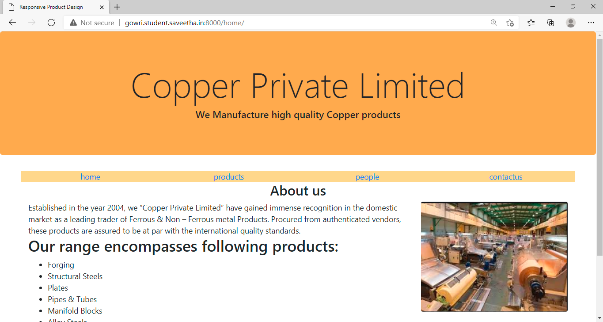

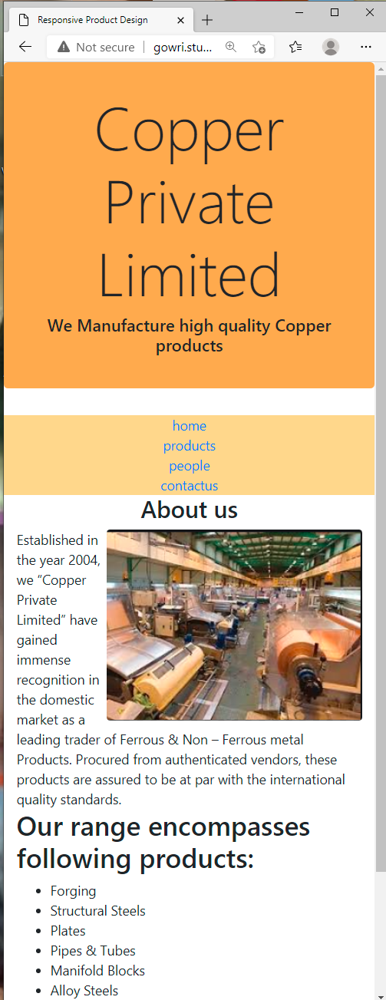

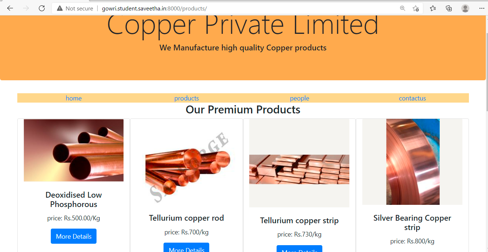

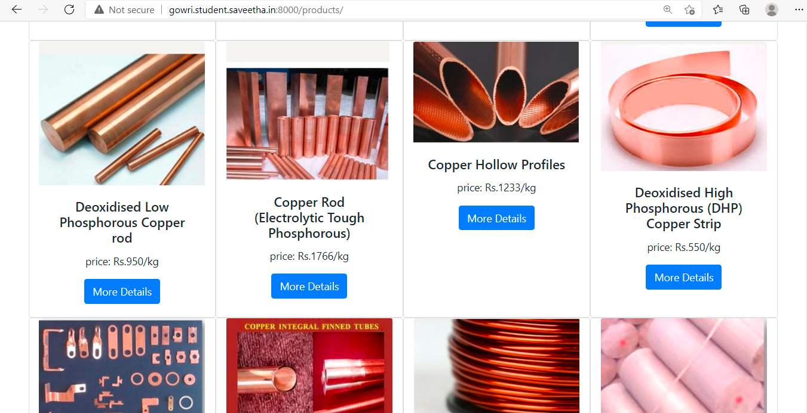

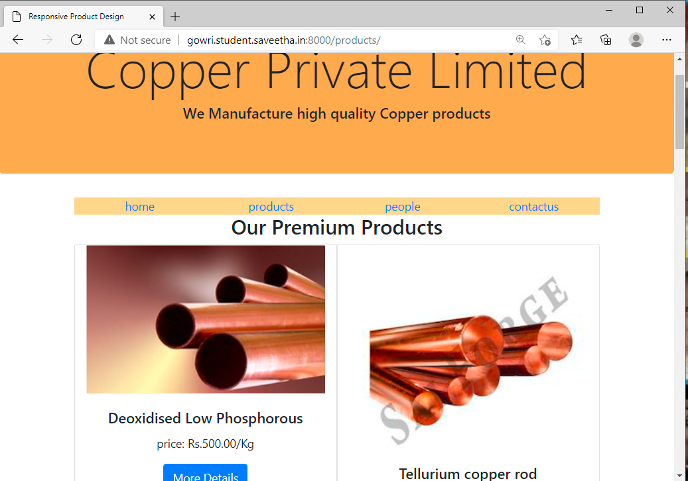

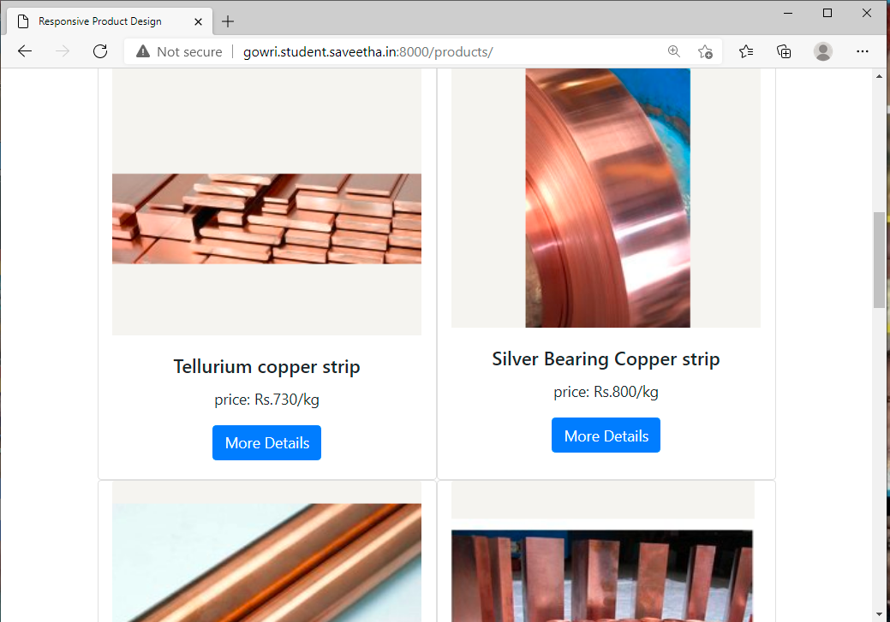

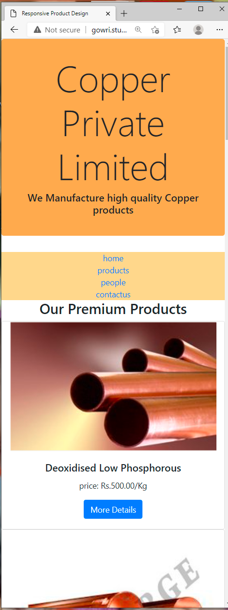

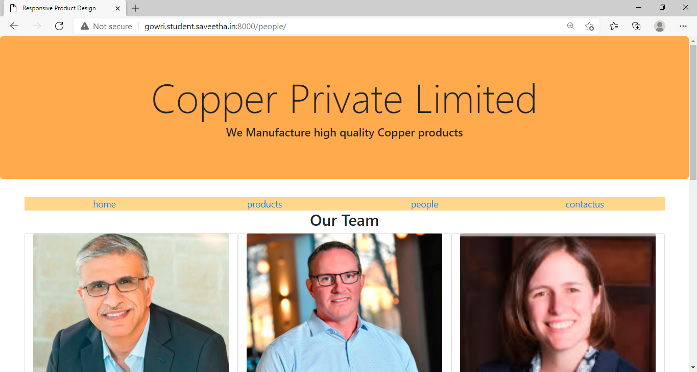

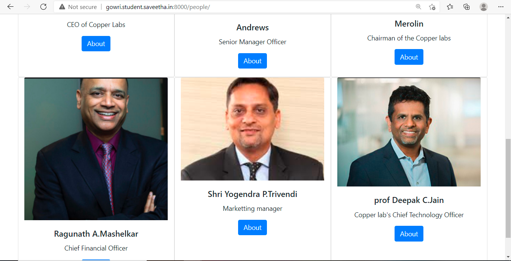

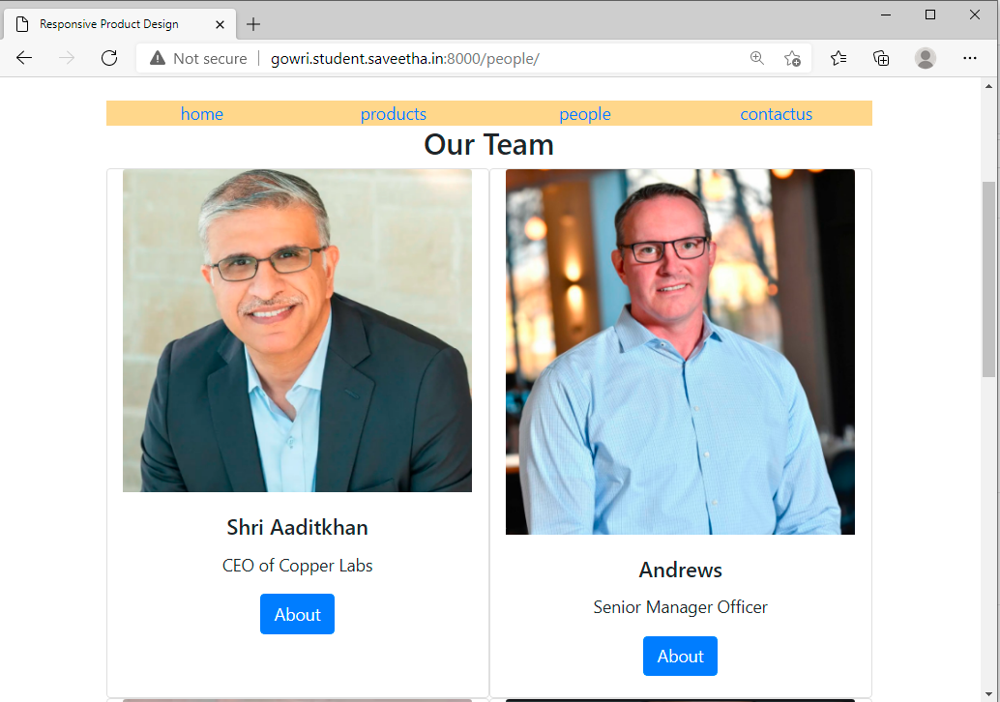

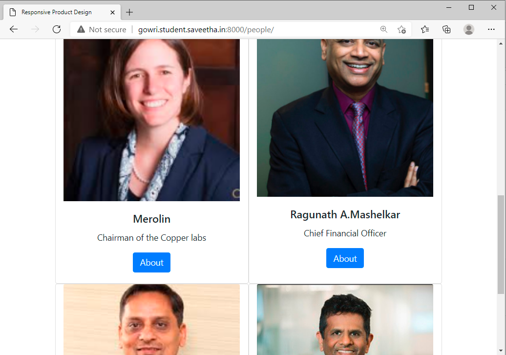

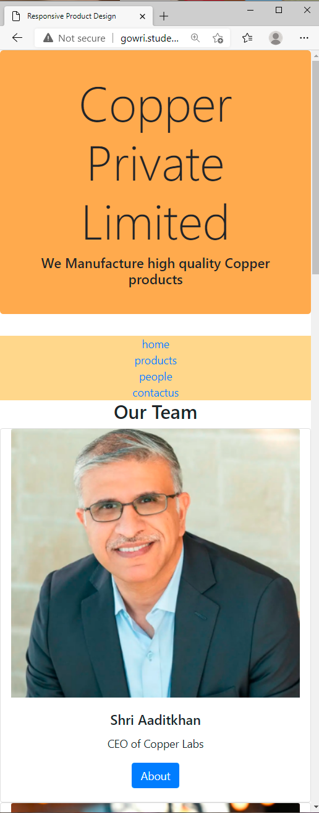

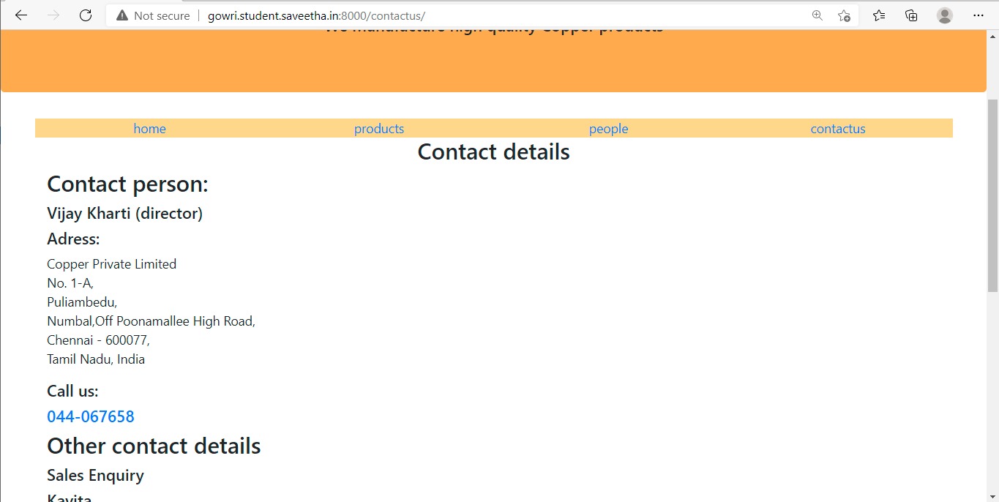

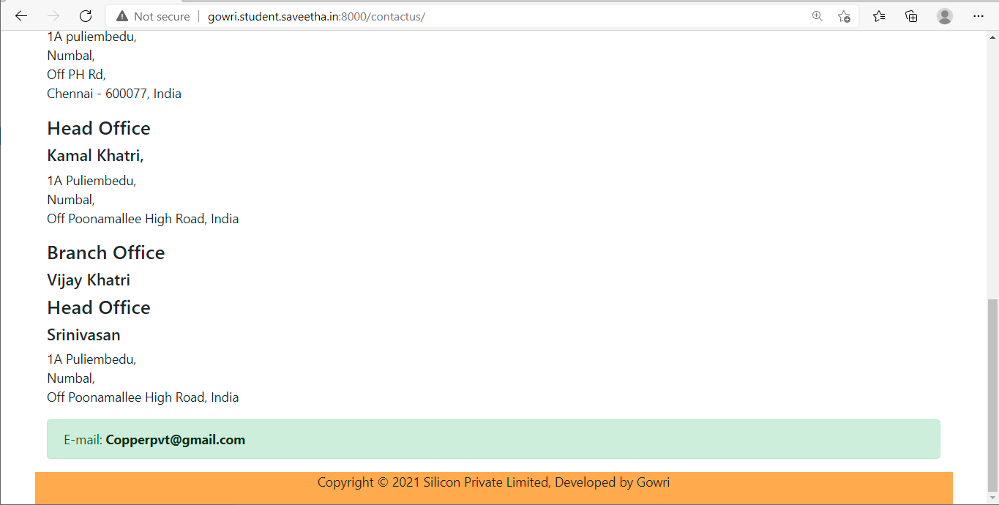

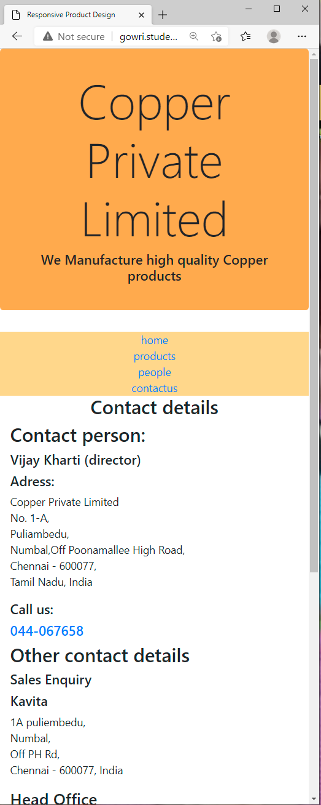

## CODE VALIDATION REPORT:
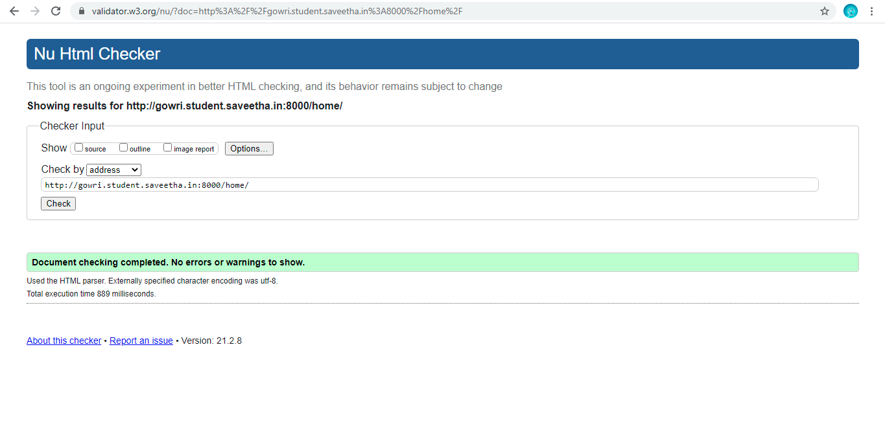

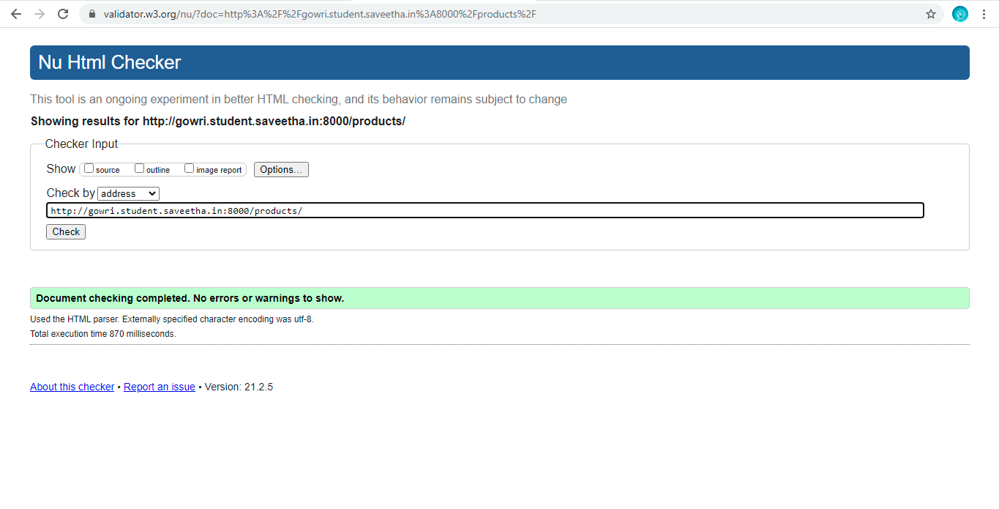

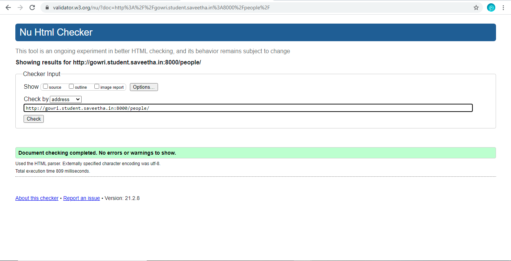


## RESULT:
 Thus a responsive website is designed for the chip manufacturing company and is hosted in the URL http://gowri.student.saveetha.in:8000/. HTML code is validated.